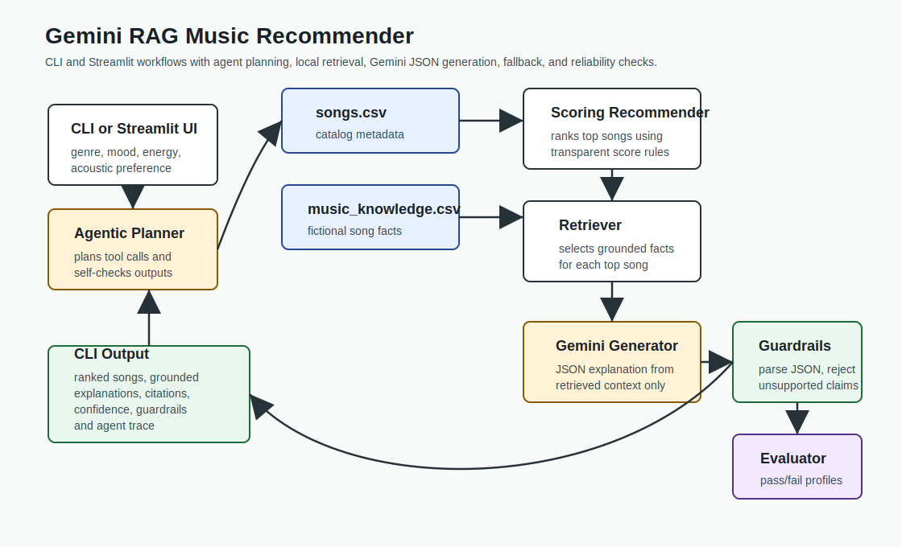

# Gemini RAG Music Recommender

## Title and Summary

This project extends my original **Music Recommender Simulation** into a small applied AI system. The original project ranked songs from a CSV catalog using transparent content-based scoring: genre, mood, target energy, and acoustic preference. The new version keeps that scoring logic, then adds retrieval-augmented generation so each recommendation includes a grounded explanation, citations, confidence, guardrail notes, and an evaluation summary.

The result is **VibeFinder**, a CLI-first recommender that can be run reproducibly with or without a Gemini API key. When `GEMINI_API_KEY` is present, Gemini generates JSON explanations from retrieved local context. When the key or SDK is unavailable, the app falls back to a deterministic local generator and logs the reason.

## Architecture Overview



The system has five main parts:

- `src/recommender.py` loads songs and ranks them with deterministic scoring.
- `data/music_knowledge.csv` stores fictional song and artist facts for retrieval.
- `src/rag.py` retrieves relevant facts, builds a constrained prompt, calls Gemini through a `TextGenerator` boundary, parses JSON, and applies guardrails.
- `src/main.py` runs the end-to-end CLI demo.
- `src/evaluation.py` and `scripts/evaluate_recommender.py` run pass/fail reliability checks across predefined profiles.

Data flow: user profile -> scoring recommender -> local fact retriever -> Gemini or fallback generator -> JSON parser and guardrails -> grounded recommendation output.

## Setup Instructions

1. Create and activate a virtual environment.

   ```bash
   python -m venv .venv
   source .venv/bin/activate
   ```

2. Install dependencies.

   ```bash
   pip install -r requirements.txt
   ```

3. Optional: set a Gemini API key.

   ```bash
   export GEMINI_API_KEY="your-key-here"
   ```

   The project never reads secrets from `document.md`. If the environment variable is missing, the CLI still runs with the local fallback generator.

4. Run the main app.

   ```bash
   python -m src.main
   ```

5. Run tests.

   ```bash
   pytest -q
   ```

6. Run the reliability evaluation script.

   ```bash
   python scripts/evaluate_recommender.py
   ```

## Sample Interactions

### Chill Lofi Profile

Input profile:

```python
{
    "favorite_genre": "lofi",
    "favorite_mood": "chill",
    "target_energy": 0.38,
    "likes_acoustic": True,
}
```

Example output:

```text
Library Rain by Paper Lanterns - Score: 11.54
Ranking signals: mood match (+3.0), genre match (+1.0), energy close to target (+5.8), matches acoustic preference (+1.7)
RAG explanation: Library Rain fits because the deterministic score and local catalog facts both point to a calm, acoustic lofi match.
Confidence: 0.62 | Generator: local-fallback
Citations: local fictional catalog notes
Guardrails: GEMINI_API_KEY is not set
```

### High-Energy Pop Profile

Input profile:

```python
{
    "favorite_genre": "pop",
    "favorite_mood": "happy",
    "target_energy": 0.85,
    "likes_acoustic": False,
}
```

Expected behavior: `Sunrise City` is recommended near the top because it matches happy pop, high energy, and less-acoustic production. The RAG layer cites local facts about Neon Echo and the song's upbeat electronic-pop style.

### Deep Intense Rock Profile

Input profile:

```python
{
    "favorite_genre": "rock",
    "favorite_mood": "intense",
    "target_energy": 0.90,
    "likes_acoustic": False,
}
```

Expected behavior: `Storm Runner` is recommended because the scoring layer sees a strong rock, intense, high-energy match, and the retriever supplies facts about Voltline's driving tempo and sharp-guitar catalog identity.

## Design Decisions

- I kept deterministic ranking separate from RAG explanation. This follows single responsibility: `recommender.py` scores songs, while `rag.py` handles retrieval, prompting, generation, parsing, and guardrails.
- I used a `TextGenerator` protocol so Gemini can be replaced by a fake generator in tests or by another provider later without changing the recommendation pipeline.
- I used local fictional facts instead of real artist facts because the song catalog is fictional. That keeps citations honest and avoids pretending the system knows real-world details.
- I deferred live web search. The current system explicitly says not to claim live web access, which is safer for a reproducible classroom demo.

## Testing Summary

The test suite covers the original recommender plus new RAG behavior:

- loading and ranking catalog facts
- prompt construction
- Gemini client boundary with a fake client
- deterministic fallback generation
- profile validation guardrails
- malformed JSON fallback
- live-web claim cleanup
- full assistant pipeline
- evaluation summary behavior

Current verification:

```text
pytest -q
16 passed
```

Evaluation script result without a Gemini key:

```text
Reliability evaluation
Passed 3 out of 3 cases
```

The AI system still behaves meaningfully without the API because the fallback generator uses retrieved context and records why it was used.

## Reflection

This project taught me that an AI feature is more trustworthy when it has boundaries. The original recommender was easy to explain because it was deterministic, so I preserved that strength and used Gemini only for the natural-language explanation layer. The guardrails helped make the system honest: it should cite local context, avoid live-web claims, and keep running when a model response is malformed or unavailable.

AI collaboration was useful for turning a class rubric into an implementation plan with separate modules and testable responsibilities. A flawed suggestion would have been to make the app read the Gemini key from `document.md`; that would have been convenient locally but unsafe and hard to reproduce. The final design uses an environment variable instead.

## Limitations and Future Work

- The catalog and knowledge base are tiny, so retrieval quality is limited.
- The facts are fictional and manually written, so they are useful for the demo but not a real music database.
- Confidence is a lightweight reliability signal, not a statistically calibrated probability.
- A future stretch version could add a web-search agent for new releases, but it should clearly separate live results from local catalog facts and include source validation.
